- [Figma](#figma)
	- [Basics of Figma tools](#basics-of-figma-tools)
		- [Creating Circle, lines with same proportions](#creating-circle-lines-with-same-proportions)
		- [Creating Shapes](#creating-shapes)
		- [Image PlaceHolder](#image-placeholder)
		- [Mask](#mask)
		- [Reuse Styles](#reuse-styles)
		- [Creating Components and Reusing Them](#creating-components-and-reusing-them)
		- [Constraining [applying limitation] Components](#constraining-applying-limitation-components)
		- [Rulers](#rulers)
	- [ShortCut](#shortcut)
		- [Zoom and Pan](#zoom-and-pan)
			- [Zoom](#zoom)
			- [Pan or Moving the canvas](#pan-or-moving-the-canvas)
		- [Duplicate](#duplicate)
		- [Direct Child Selection](#direct-child-selection)
		- [Search anything - Quick Action](#search-anything---quick-action)

# Figma

## Basics of Figma tools

### Creating Circle, lines with same proportions

- press `SHIFT` then draw to preserve ratio:

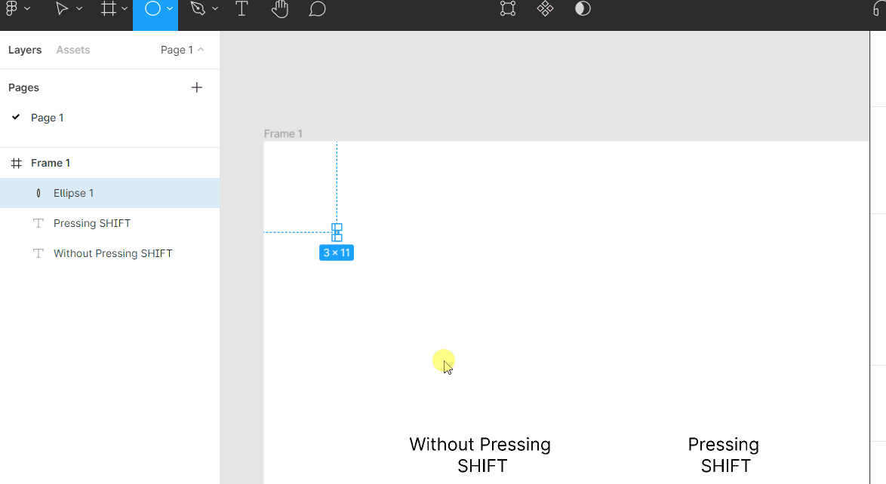

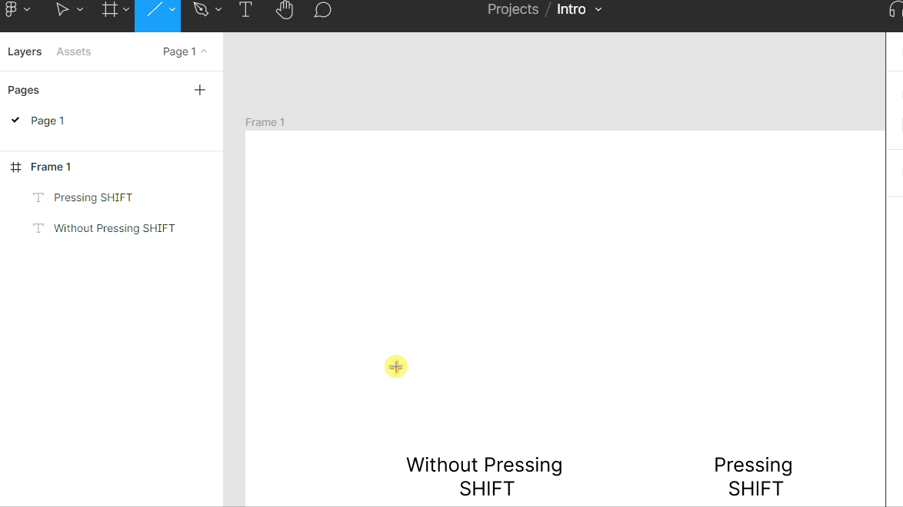

### Creating Shapes

- Pie, Ring with circle's Arc

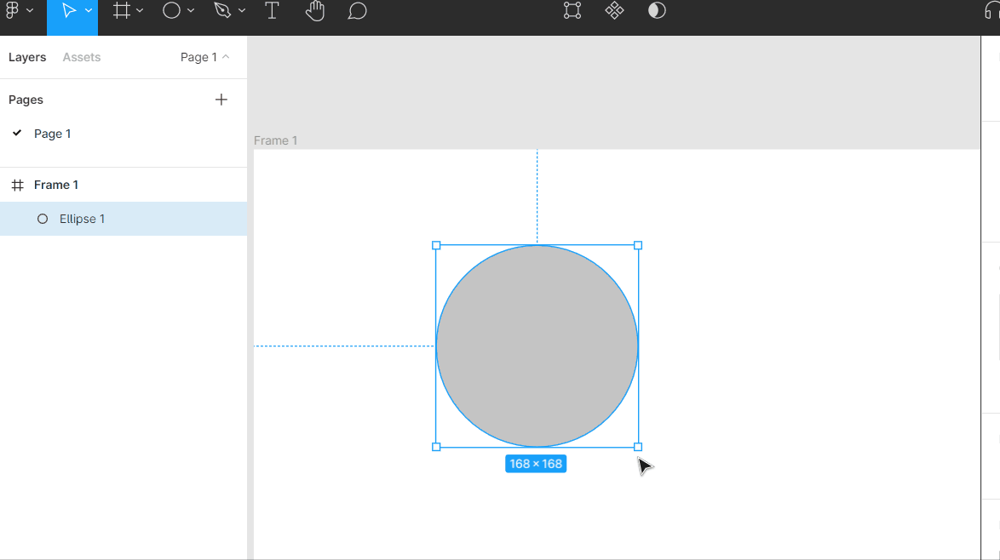

### Image PlaceHolder

- Placing Image

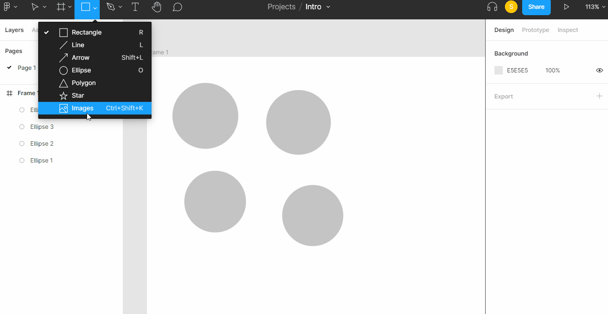

- Changing Image Quickly

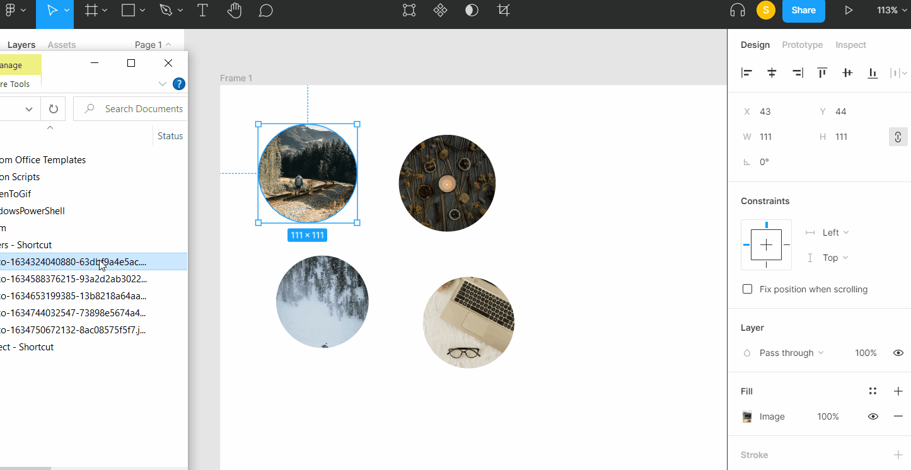

### Mask

- Use as Mask

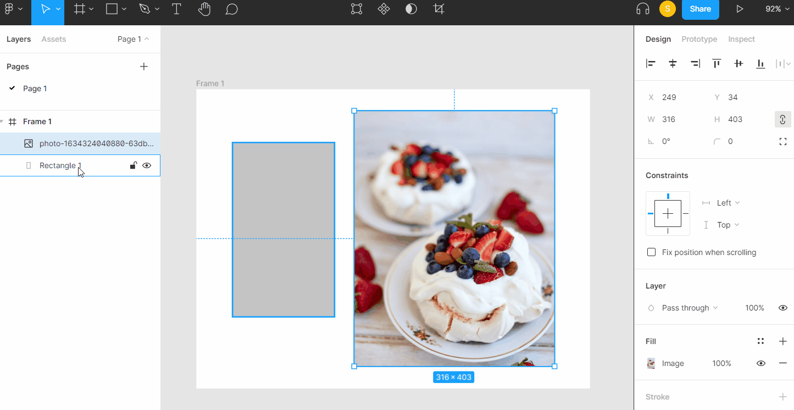

### Reuse Styles

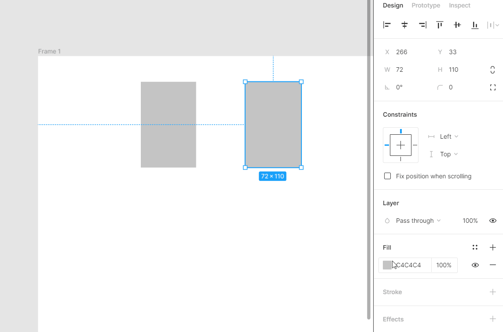

> Likewise, styles can also be created for Text,Effects and other component.

- Creating Style Hierarchy

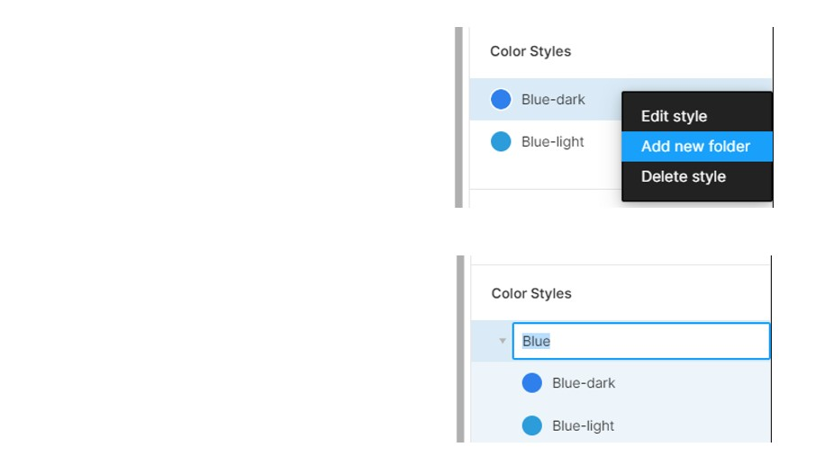

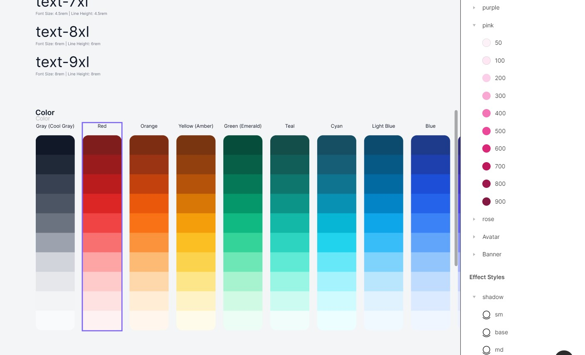

### Creating Components and Reusing Them

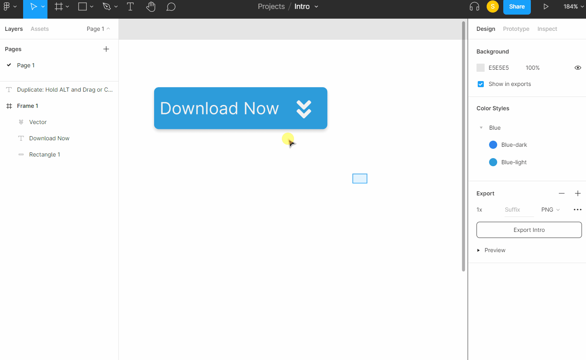

> Instance can be detach from master components through `Detach Instance` option or `Ctrl+Alt+B` key

### Constraining [applying limitation] Components

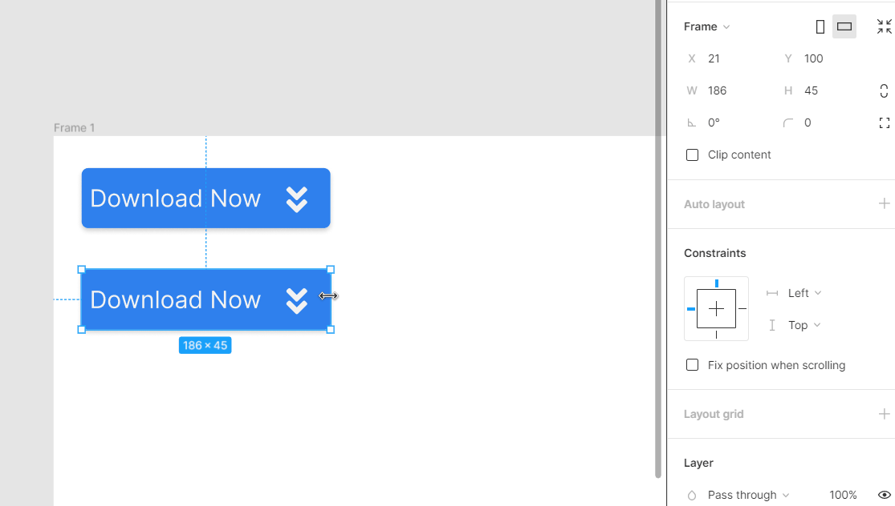

> !!WATCH OUT: Constrain only works with `Components'

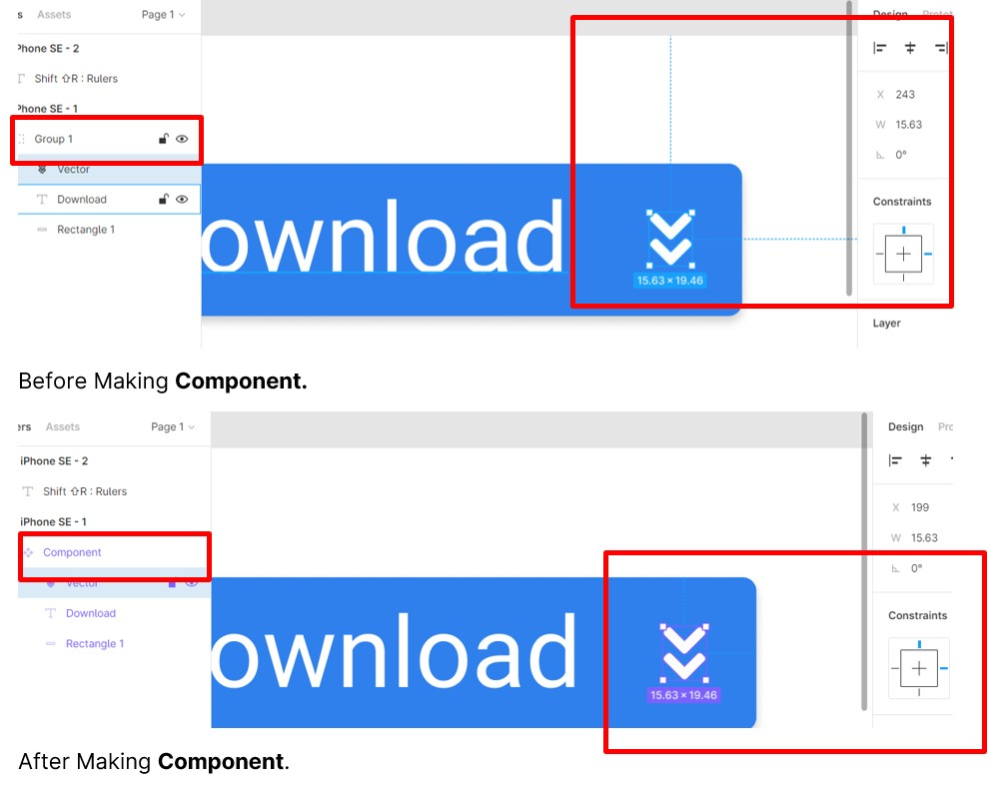

### Rulers

- `Shift ⇧R`

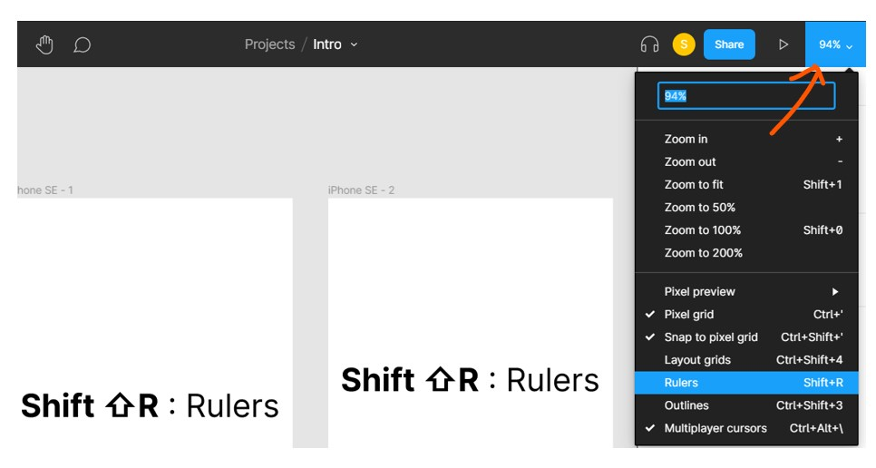

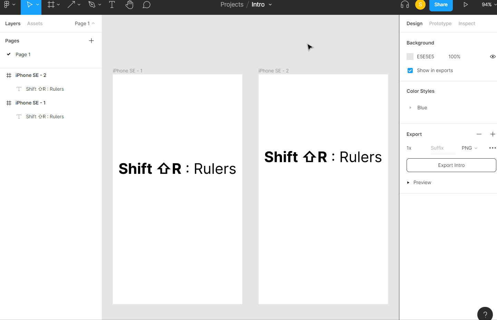

## ShortCut

### Zoom and Pan

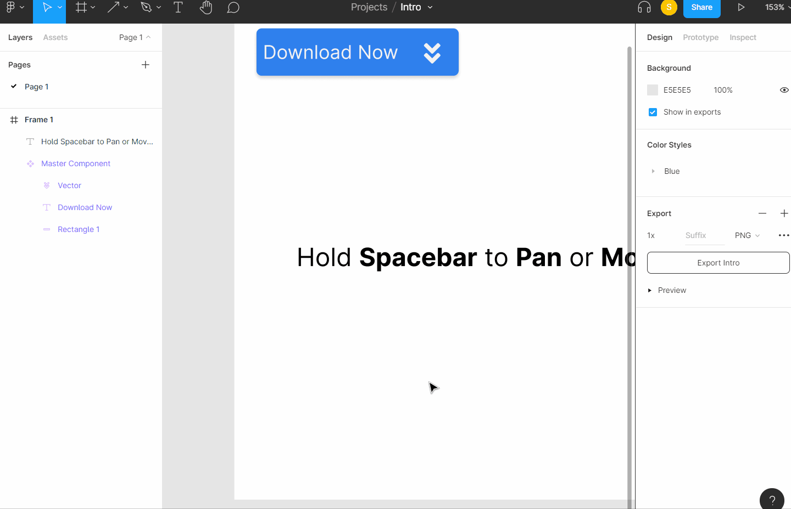

#### Zoom

- The standard zoom commands are accessed with `Ctrl+(+)`, `Ctrl+(-)` , `Ctrl + Mouse Wheel`

Those commands will just focus in on the center of your current view. But there are some other handy zoom commands available:

- `Shift ⇧2` will zoom to the **current selection**
- `Shift ⇧1` will zoom to show the **whole canvas**

Finally, here’s an *extra* handy zoom tip to move between Frames without having to zoom in and out the whole time:

- `N` will zoom to the next Frame
- `Shift ⇧N` will zoom to the previous Frame

#### Pan or Moving the canvas

- Hold `Spacebar` to Pan or Move Canvas

### Duplicate

- Hold `ALT` and Drag to duplicate or,
- With current shape selected, simply hit CTRL-D to duplicate the shape. You can also CTRL-C and CTRL-V (copy and paste) for the same behavior.

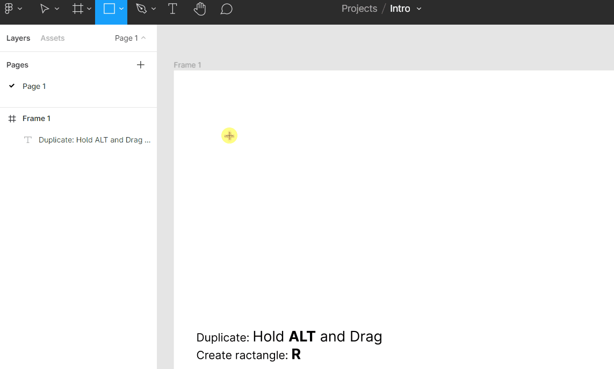

### Direct Child Selection

- Hold `Ctrl` and Select Child to select Child element directly without double click

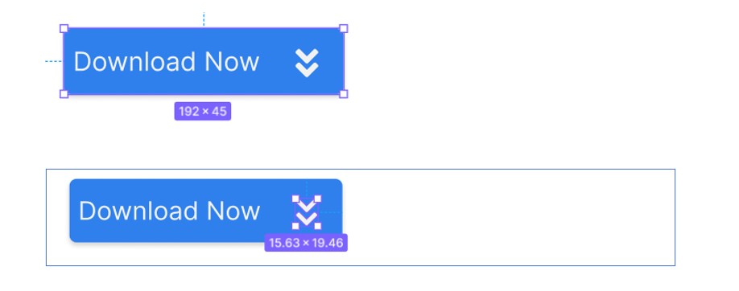

### Search anything - Quick Action

- Right Click > `Quick Actions`
- `Ctrl+/`

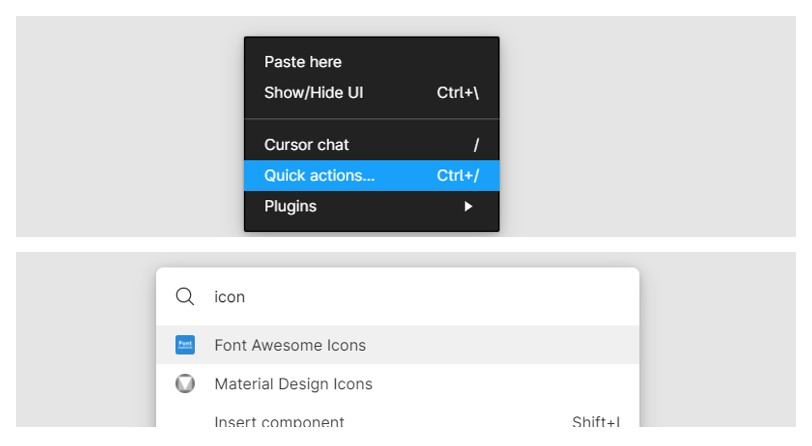

